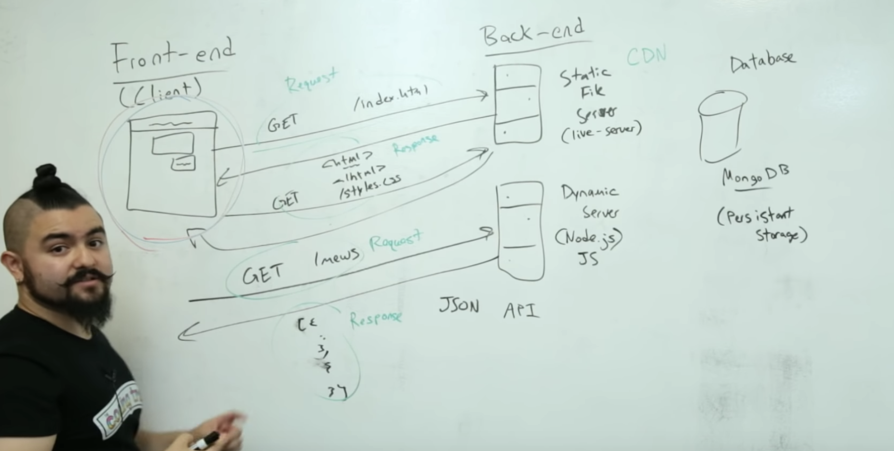
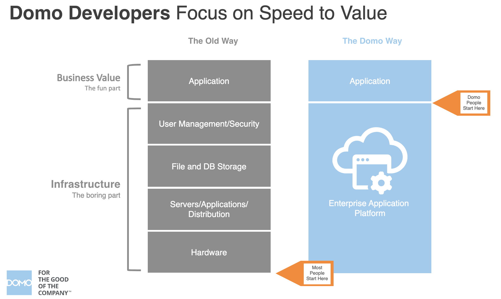
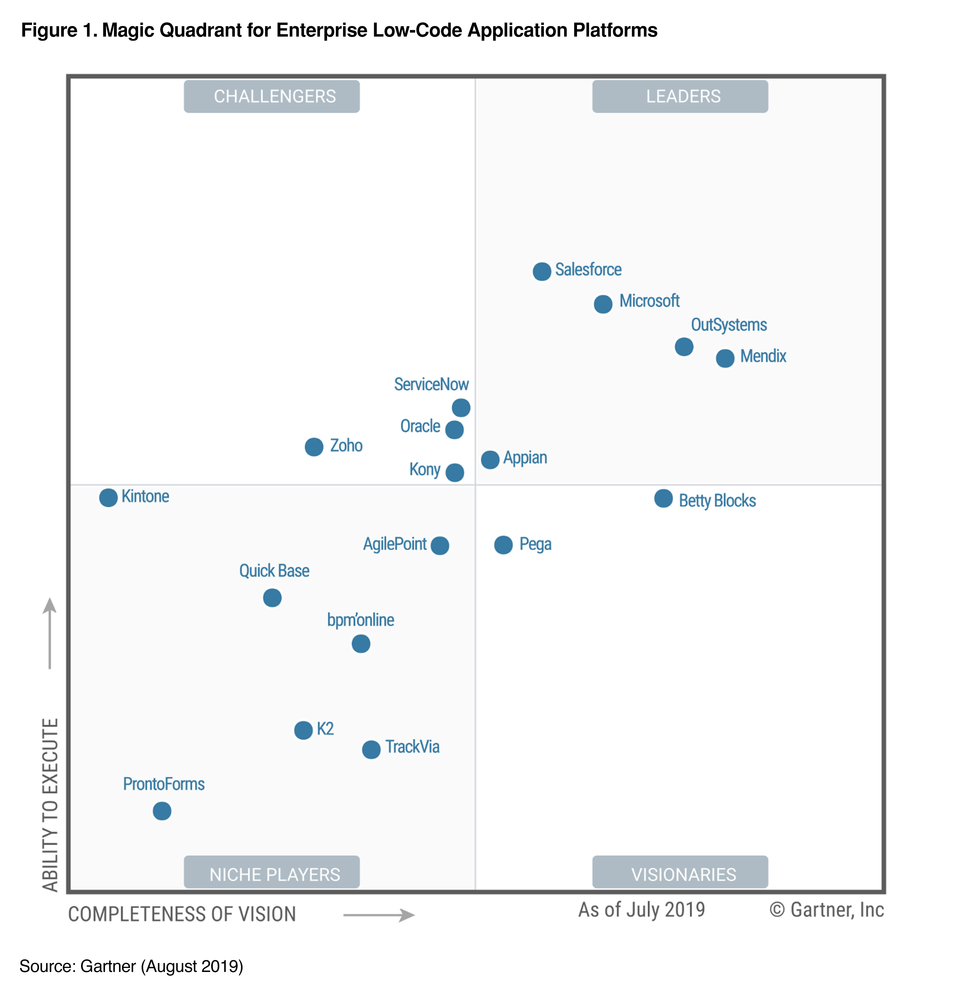

Back in December, the manager of Enterprise Sales for Domo EMEA asked me what my favourite feature of Domo was. As I mulled over my answer over a pint at the pub, it hit me. The best thing about Domo is the company's dogged commitment to delivering value through data interaction.

I'll cut the preamble and get to the love story. I like to tinker with data. This week it's a recursive query in SQL, the next a data science project in Python. A month ago it was an app integrating NLP with raw text. Instead of watching Netflix on the tube, during my commute to work, I've started playing the game: "how could you build XYZ product in Domo."

Want to design a MarketWatch style service you can resell to your clients? Domo's got all the tools you need.

- use Domo's Connector framework to aggregate social media datasets and scrape websites.
- use Enterprise Stacker to consolidate the datasets.
- use a custom app to pair entity recognition and sentiment analysis with end-user validation.
- use Domo Publish to distribute relevant data and dashboards to your clients.
- buy a boat. Retire young.

The best part about developing apps in Domo is the unprecedented time to value. Unfortunately, to appreciate the brilliance of Domo's serverless app development framework, you have to understand App development without Domo.

This image comes from a [tutorial on building a Twitter clone from scratch](https://www.youtube.com/watch?v=JnEH9tYLxLk). In it, CJ describes how all the pieces of infrastructure must come together in the backend to support the app.

Don't have an hour for a youtube tutorial? Here's the good news:

Developers hosting apps in Domo get to ignore infrastructure configuration because provisioning is automated; instead, they can focus 100% of their effort on front-end app development.

I don't think you get it!

With a single command issued in Terminal, **domo dev,** you provision a No-SQL database and gain access to a virtually unlimited file storage framework governed and secured in Domo's world-class enterprise infrastructure.

With Domo you skip the low-value but high-effort investment in infrastructure configuration and just enjoy the thrill of app development!

## Isn't Domo **a BI company? Why the interest in app development?**

Domo's serverless app platform heralds the arrival of Business Intelligence 4.0.

Yeah, l I know. Go with me on this.

- First generation business intelligence was marked by client/server architecture and IT led reporting.
- In BI 2.0 we saw the the expansion into the cloud driven by the big data revolution.
- With BI 3.0 business oriented data democratization featured an emphasis on personal, collaborative and mobile-first data interactions.
- Domo embraces BI 4.0, the integration of cognitive computing and machine learning steered by end-user interaction, through lightweight apps which can easily integrate into daily business processes and data aggregation workflows.

## The Big Features

- **Domo Actions** allows developers to create code snippets that access the Domo Accounts framework. For example, to update a record in SalesForce, you'll send an API request with authentication credentials stored in Domo (not the app's source code).
- Custom apps in Domo are rendered as cards which entitles them to all available distribution modes including **mobile, Publish** or **embedded** **access.**
- Developers can store app settings and user interactions in AppDB a no-SQL database or send files generated in the app to the Files API.

**The End**

---

When I think about all the projects I started and abandoned over the years, I get really excited about the position Domo puts me in every time I crack open my laptop�lead app developer on a framework that's guaranteed to work from the first keystroke.

There's no time like the present to get started. If you haven't already go to terminal and type:

- npm install -g ryuu
- domo init

Have fun building!

[https://b2bsalescafe.files.wordpress.com/2019/09/gartner-magic-quadrant-for-enterprise-low-code-application-platforms-august-2019.pdf](https://b2bsalescafe.files.wordpress.com/2019/09/gartner-magic-quadrant-for-enterprise-low-code-application-platforms-august-2019.pdf)

